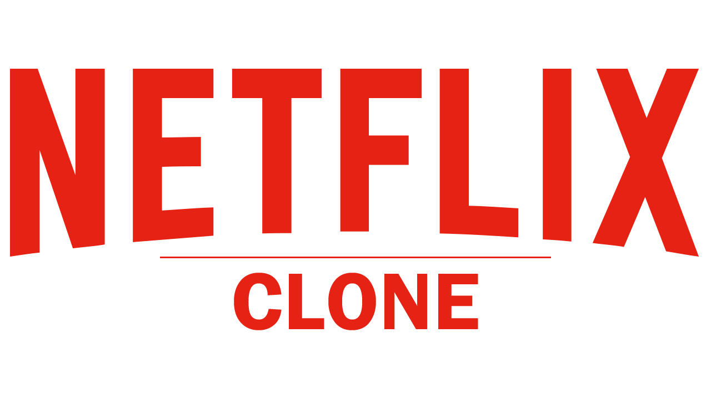

<h1 align="center"> Netflix Clone </h1>

  <a href="#-tecnologias">Tecnologias</a>&nbsp;&nbsp;&nbsp;|&nbsp;&nbsp;&nbsp;
  <a href="#-projeto">Projeto</a>&nbsp;&nbsp;&nbsp;|&nbsp;&nbsp;&nbsp;
  <a href="#-layout">Layout</a>&nbsp;&nbsp;&nbsp;|&nbsp;&nbsp;&nbsp;
  <a href="#memo-licença">Licença</a>

  

 

  

## 🚀 Tecnologias

Esse projeto foi desenvolvido com as seguintes tecnologias:

- HTML e CSS
- TypeScript
- Styled Components
- Consumo API
- Git e Github
- Figma

## 💻 Projeto

O Projeto do Netflix Clone, consiste na construção do layout do site Netflix, sendo abastecido com dados da API do The Movie DB [TMDb](https://www.themoviedb.org/).

## 🔖 Layout

Você pode visualizar o projeto através [DESSE LINK](https://charles-netflixclone.vercel.app/).

## :memo: Licença

Esse projeto está sob a licença MIT.

---